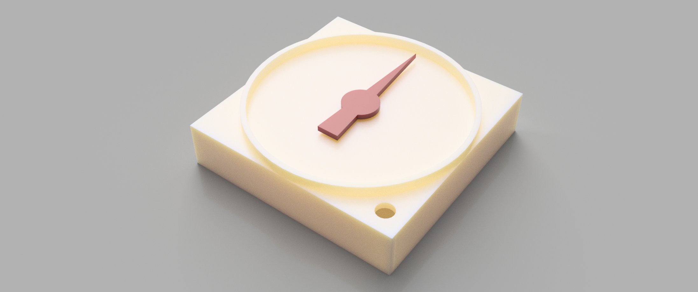

# STL

## Completion Rendering

# About Each Part
There are seven parts in [data folder](./data/).  
* [frame.stl](./data/frame.stl)
* [needle guard.stl](./data/needle%20guard.stl)
* [needle.stl](./data//needle.stl)
* [position socket.stl](./data/position%20socket.stl)
* [position.stl](./data/position.stl)
* [stepping motor socket.stl](./data/stepping%20motor%20socket.stl)
* [top.stl](./data/top.stl)

